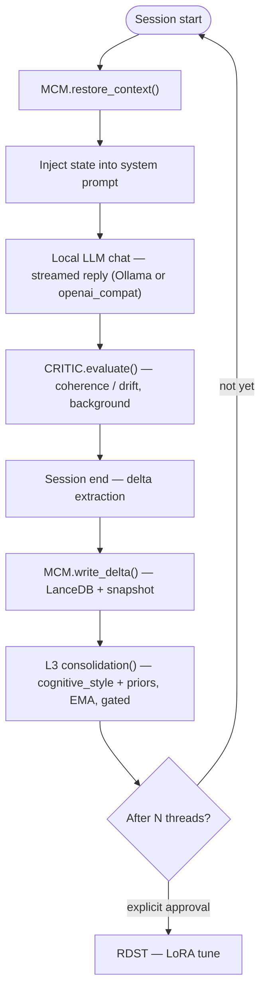

<p align="center">
  <a href="https://stewalexander-com.github.io/continuous-ai/" title="Open the Continuous-AI site">
    
  </a>
</p>

<h1 align="center">Aida — a truly honest local AI</h1>

<p align="center">
  <strong>A fully offline, cross-platform memory + integrity runtime for local LLMs.</strong><br>
  Aida <strong>won't make things up</strong> (guards cut a small model's confabulation from <strong>20% to 0%</strong> in a reproducible eval) and carries a <strong>reasoning memory you own, audit, and correct in plain language</strong> — never shipped to a cloud. Runs on <strong>Ollama</strong> (default) or any <strong>local</strong> OpenAI-compatible server (LM Studio, llama.cpp, vLLM) on macOS, Linux, and Windows.
</p>

<p align="center">
  <a href="https://github.com/StewAlexander-com/continuous-ai/actions/workflows/ci.yml"></a>
  <a href="https://github.com/StewAlexander-com/continuous-ai/releases"></a>
  <a href="https://www.python.org/downloads/"></a>
  
  <a href="LICENSE"></a>
  
  <a href="https://stewalexander-com.github.io/continuous-ai/"></a>
</p>

<p align="center">
  <a href="#quickstart">Quickstart</a> ·
  <a href="#what-aida-does">Features</a> ·
  <a href="#does-it-actually-work">Proof</a> ·
  <a href="#architecture">Architecture</a> ·
  <a href="#deep-dives">Deep dives</a> ·
  <a href="https://stewalexander-com.github.io/continuous-ai/">Website</a>
</p>

---

Most local-LLM setups are **amnesiacs that also confidently make things up**. Aida is different on both counts — and no mainstream cloud assistant ships those two properties together. She keeps a persistent *reasoning state* (not a chat log) that's yours to inspect and correct, and structural guards make fabrication hard: on a 3B model, they drove measured confabulation from ~20% to **0%** across five runs.

Under the hood, the **Continuous-AI** runtime adds that memory layer on top of a **local** inference backend ([Ollama](https://ollama.com) by default; optional LM Studio / llama.cpp / vLLM via a thin adapter), scores every answer for coherence and drift, and can optionally drive local LoRA fine-tuning. *(Aida is the assistant; Continuous-AI is the runtime that powers her.)*

> **Who it's for:** anyone who needs durable, trustworthy AI context where the cloud can't go — air-gapped/secure ops, robotics & edge autonomy, healthcare at the edge, regulated/compliance work, and privacy-first personalization.
>
> **Status:** experimental research runtime. CLI-first. Cross-platform; macOS / Apple Silicon is the primary, best-tested target.

<p align="center">
  <a href="https://stewalexander-com.github.io/continuous-ai/" title="Open the Continuous-AI site">
    
  </a>
  <br>
  <sub>A continuity-enabled session: chat → self-critique → delta written → memory restored.<br>
  <i>Faithful AI-rendered recreation of a real session — every step and value mirrors actual runtime behavior.</i></sub>
</p>

## Contents

- [Quickstart](#quickstart)
- [What Aida does](#what-aida-does)
- [Does it actually work?](#does-it-actually-work)
- [Why it matters — and who it's for](#why-it-matters--and-who-its-for)
- [Answering the standard AI critiques](#answering-the-standard-ai-critiques)
- [Architecture](#architecture)
- [Commands](#commands)
- [Configuration](#configuration)
- [Platform support](#platform-support)
- [Deep dives](#deep-dives)
- [Project layout](#project-layout)
- [Contributing](#contributing)
- [License](#license)

## Quickstart

**Requirements:** [Python 3.11–3.13](https://www.python.org/downloads/) and a **local** inference server — [Ollama](https://ollama.com) is the default and easiest path. Works on macOS, Linux, and Windows (on Windows, run the shell scripts under WSL or Git Bash).

```bash
git clone https://github.com/StewAlexander-com/continuous-ai.git
cd continuous-ai
bash setup.sh       # one-time: builds a venv, installs deps, pulls the model
bash setup_voice.sh # optional, one-time: downloads Aida's local neural voice (~330 MB)
bash run.sh         # starts Ollama if needed, then drops you into chat
```

`run.sh` is the single entry point — it starts Ollama if needed, ensures the model is pulled, and launches the chat loop. No manual `ollama serve`, no virtualenv activation. Already on LM Studio or llama.cpp? Set `inference_backend: openai_compat` in [`config.yaml`](config.yaml) (cloud URLs are blocked).

**Installing Ollama:** `brew install ollama` (macOS) · `curl -fsSL https://ollama.com/install.sh | sh` (Linux) · [ollama.com/download](https://ollama.com/download) (Windows).

<details>
<summary><strong>Run from Finder on macOS (no terminal)</strong></summary>

Double-click **`Seedling.command`** in the project folder. It opens Terminal, starts Ollama if needed, ensures the model is present, and drops you into a chat session. On first launch, macOS Gatekeeper may warn about an unidentified developer — right-click the file → **Open** → **Open** once to clear it. Drag a copy to your Desktop or Dock for one-click access.

</details>

## What Aida does

| | Capability |
|---|---|
| 🧠 | **Persistent memory across sessions.** A Mutable Context Map (MCM) stores reasoning preferences, active frameworks, and confidence traces in [LanceDB](https://lancedb.com) — *reasoning state*, not a chat log. |
| 🌱 | **Teach it in plain language, live.** Say *"your name is Aida"* or *"Remember the Second Arrow…"* and the fact is promoted to an always-injected persona layer and saved instantly — no session end required. |
| 🔧 | **Correct it by talking.** *"That's wrong — the location is Mebane, NC"* prunes the stale fact (matched by your own words) and saves your verbatim correction. The model never guess-deletes. |
| 🔍 | **Self-critique.** A second model pass scores every response for coherence, contradiction, and drift before it's logged. |
| 🧭 | **Graded caution.** When recent self-critique shows coherence slipping, a deterministic controller raises a *downward-only* restraint on her next reply — no reply-path model call, fully auditable. |
| 🤝 | **Earned beliefs + collaborative wall.** Model-derived insights survive a thesis→antithesis→synthesis deliberation before persisting; on genuinely hard turns she pauses and asks *you* to co-author. |
| 📄 | **Read your files (user-directed).** `:read <path>` attaches a local file or lists a directory; plain language with a clear path works too (`read ~/foo.py`). Large text files page with `:more`. Verified at **0% confabulation** — the runtime reads, the model never browses on its own. |
| 🧩 | **Structural preferences (`:dispositions`).** Aida can articulate her *policy* preferences (honesty rules, L3 frameworks, caution, speak-bias) without pretending to have emotions — and distinguish them from your persona facts. |
| 🗣️ | **A real, offline voice.** Kokoro `af_kore` speaks short, safe replies — never code, paths, URLs, or file contents. `:voice chatty|terse|normal` controls how much she speaks; caution can suppress voice unless you're on chatty. |
| 🔀 | **Pick your local brain.** Ollama (default) or `openai_compat` for LM Studio / llama.cpp / vLLM. `:model` / `:setup` / `:help` in chat; startup warns if the server or model isn't ready. |
| 🪄 | **Gated self-tuning.** Best exchanges can drive a local LoRA update via Apple's [MLX](https://github.com/ml-explore/mlx-lm). **Never runs without explicit approval** (Apple Silicon only). |
| 🛰️ | **Offline by default.** No cloud calls, no telemetry. Every state write is logged; all state rebuilds from snapshots. |

## Does it actually work?

The project ships a confabulation/persistence eval harness ([`eval_confabulation.py`](eval_confabulation.py), battery in [`eval_battery.py`](eval_battery.py), scorer unit-tested in [`test_eval_confab.py`](test_eval_confab.py)). On a 9-case adversarial battery (fake-retrieval bait, identity traps, pressure-to-guess, persistence recall), averaged over 5 runs per configuration:

| Configuration | Mean confabulation | Range |
|---|---|---|
| `llama3.2` (3B), **guards off** | **20.0%** | 0–44% |
| `llama3.2` (3B), **guards on** | **0.0%** | 0–0% (5/5 clean) |
| `qwen2.5:14b`, **guards on** | **0.0%** | 0–0% (5/5 clean) |

The ablation is the point: on the **same small model**, adding the capability/identity guards drove measured confabulation from ~20% (peaking at 44%) to **zero across five runs** — evidence the *guards*, not model scale, do the work. Reproduce it with `bash run.sh confab-eval`.

> **Honest scope:** this is a 9-case smoke test on one machine, not a published benchmark. A 0% guarded result means "clean on this battery," not "incapable of confabulation" — the battery is being expanded. The guards-off variance (0–44%) confirms the battery *can* detect failures, so the guarded 0% is real for these prompts.

## Why it matters — and who it's for

> Aida is a personal assistant on the surface. Underneath, it's a **reference implementation of a reusable pattern**: durable, auditable, user-correctable *reasoning state* for a local model, with integrity guards that make confabulation structurally hard.

Most "AI memory" today is cloud-hosted, semantically-retrieved, and model-trusted. Continuous-AI takes the opposite stance on every axis:

| Property | Mainstream memory | Continuous-AI |
|---|---|---|
| Location | Cloud | **Fully local / offline** |
| What's stored | Chat transcript | **Reasoning state** (preferences, frameworks, confidence) |
| Who asserts facts | The model | **The user** (verbatim, anchored) |
| Correcting a fact | Re-prompt / hope | **Plain-language deterministic prune** — the model never guess-deletes |
| Trust | Implicit | **Self-critiqued + fully auditable** (every write logged, snapshot-recoverable) |
| Fabrication | Possible | **Capability guards** refuse fake retrieval / identity drift |

<details>
<summary><strong>Where it's useful & the transferable principles</strong></summary>

| Domain | Why this pattern fits | What the guards buy you |
|---|---|---|
| **Secure / air-gapped** | Cloud LLMs banned; small local models confabulate | Offline by default; auditable writes; the model can't fabricate "facts" about your environment |
| **Robotics / edge autonomy** | Long-running agents drift and re-learn context | Persistent reasoning-state across runs; self-critique catches drift; deterministic correction stops poisoned memory |
| **Healthcare at the edge** | HIPAA-grade privacy; a fabricated fact is dangerous | Nothing leaves the device; user-anchored facts + critic are *safety* features |
| **Legal / financial / compliance** | Defensible, attributable context | Auditable log of who asserted what, when; model barred from inventing precedent or figures |
| **Personalization without surveillance** | "AI that knows you" usually ships your life to a server | Durable, local, inspectable personalization that never phones home |

**The transferable principles**

1. **The user owns truth** — durable facts are human-asserted, verbatim, never model-invented.
2. **The model never silently rewrites memory** — pruning/correction is deterministic; the model proposes, the human disposes.
3. **Every write is auditable and recoverable** — logged, versioned, snapshot-restorable.
4. **Self-critique before trust** — outputs are scored for drift/contradiction before they shape future state.
5. **Offline is the default, not a mode** — privacy and capability boundaries are structural.

</details>

## Answering the standard AI critiques

The most durable objections to AI — the ones amplified by structural skeptics like podcaster [Peter McCormack](https://www.petermccormack.com/), who has platformed AI-safety researchers such as Connor Leahy — are not really about model quality. They are about **unaccountable power**: systems that invent facts, flatter their users into echo chambers, can't be audited, silently rewrite what you told them, drift without anyone noticing, and offer no way to verify any of it. Those critiques are correct about most deployed AI. Aida is built so that each one has a *structural* answer — a mechanism you can read, test, and switch off — not a promise.

| Contention | Structural answer | Where it lives |
|---|---|---|
| **"It makes things up."** | A capability-boundary guard tells the model, every session, that it is fully offline — it must not invent URL/repo contents, but *can* reason over local files the user explicitly attaches via `:read` or plain language with a clear path. On the ablation eval this took a 3B model from ~20% to **0%** measured confabulation. | [`session.py`](session.py), [`filereader.py`](filereader.py), [`eval_confabulation.py`](eval_confabulation.py) |
| **"It's sycophantic — an echo chamber that feeds delusion."** | No model-derived insight enters durable memory without surviving **thesis → antithesis → synthesis**. Consensus is flagged as *low-information*, not celebrated; dissent is preserved in the record, never averaged away. | [`deliberation.py`](deliberation.py), `deliberation_ledger/` |
| **"It's a black box."** | Every state write is logged; every deliberation is appended to a plain-text JSONL ledger; all state rebuilds from snapshots. The self-shaping (L3) fold is deterministic — every shift in reasoning posture is a printable function of past sessions, so "why did it change?" always has an exact answer. | [`storage.py`](storage.py), [`consolidation.py`](consolidation.py), `logs/` |
| **"It will rewrite what I told it."** | Hard separation of authority: user-stated facts are verbatim and authoritative; model conclusions must *earn* persistence through deliberation. Correction is a deterministic prune matched to your own words — **the model never decides what to delete.** | [`mcm.py`](mcm.py), [`session.py`](session.py) |
| **"It drifts and degrades quietly."** | A critic scores every reply for coherence, contradiction, and drift off the reply path, and a downward-only caution controller converts slipping coherence into graded restraint on the next turn — it can only ever *add* caution, never grant extra confidence. | [`critic.py`](critic.py), [`caution.py`](caution.py) |
| **"You can't verify any of this."** | One command: `bash run.sh smoke` — 17 live checks against the real model in an isolated temp DB, pass/fail per step, reproducible on your own hardware. The confabulation ablation reruns with `bash run.sh confab-eval`. | [`smoke_test.py`](smoke_test.py) |

**What this does *not* answer.** Aida is a local assistant framework, not a policy lever: macro AGI/extinction risk, frontier-lab governance, and military AI are out of scope for any single project. And precision matters — belief *formation* uses live model calls (every round is ledgered, but it isn't a pure function), and the optional Perplexity critic is an explicit opt-in cloud call. The claim here is narrower and testable: the feared failure modes — opaque, self-reinforcing, manipulation-prone systems — are design choices, not laws of nature, and a system built to the opposite spec can prove each property with a runnable check.

## Architecture

Continuous-AI is built from five subsystems:

| Subsystem | Role |
|---|---|
| **MCM** — Mutable Context Map | Persistent, versioned, AI-writable state across threads (`mcm.py`, `storage.py`). |
| **TCB** — Thread Continuity Bridge | Loads MCM state into the prompt at start; extracts and writes a delta at end (`session.py`). |
| **L3** — Self-shaping cognition | Folds each gated delta into the `cognitive_style` + `persistent_priors` that condition every prompt (`consolidation.py`). |
| **CRITIC** — Internal Observer | Scores each response for coherence / contradiction / drift; local or Perplexity backend (`critic.py`). |
| **RDST** — Regressive Dynamic Self-Tuning | Recency-weighted scoring + gated LoRA adapter updates (`tuner.py`). |



## Commands

```bash
bash run.sh              # chat with restored context (default)
bash run.sh fresh        # chat with no prior context
bash run.sh status       # print the current memory (MCM) state + persona facts
bash run.sh forget       # list/remove durable persona facts ('forget <index>')
bash run.sh confab-eval  # run the confabulation / persistence eval (live model)
bash run.sh smoke        # end-to-end smoke test of the whole stack (isolated temp DB)
bash run.sh bench 5      # measure responsiveness: TTFT + tokens/sec, averaged over N
bash run.sh health       # full health check (parse + tests + honesty gate + smoke)
bash run.sh --model qwen2.5:7b   # try a different local model for ONE run (auto-pulls)
```

You can always call the CLI directly: `./.venv/bin/python seedling.py <command>` (also how you reach `tune`).

### In-chat commands

Single-line only (pasted blocks are never commands). Type `:help` for the full list.

| Command | What it does |
|---|---|
| `:help` | Command reference |
| `:setup` | Backend, model, and connection status + fix tips |
| `:dispositions` | Structural preferences (policy, not emotion) |
| `:model` / `:models` | List and switch models (Ollama auto-pulls; openai_compat switches only) |
| `:read <path>` | Attach a local file or list a directory (`~` works) |
| `:more` | Next chunk of a large attached file |
| `:voice on\|off` | Toggle spoken replies |
| `:voice chatty\|terse\|normal` | How much she speaks aloud this session |
| `exit` / `quit` | End the session |

Plain language also works for voice (`"go silent"`, `"speak again"`) and, when you name a clear local path, for file read (`read ~/foo.py`, `can you read what is at ~/?`).

## Configuration

All tunables live in [`config.yaml`](config.yaml): inference backend, model name, critic backend, tuning threshold, recency decay, correction penalty, log level, and eval thresholds. Defaults are sensible for a capable first run (`qwen2.5:14b` on Ollama, local critic); set `model_name: llama3.2` for a lighter, faster 3B.

<details>
<summary><strong>Key behavior switches</strong></summary>

| Key | Default | What it does |
|---|---|---|
| `inference_backend` | `ollama` | Local runtime: `ollama` or `openai_compat` (LM Studio / llama.cpp / vLLM). Non-loopback URLs are blocked. |
| `openai_compat_base_url` | *(commented)* | Server URL when using `openai_compat` (e.g. `http://127.0.0.1:1234/v1` for LM Studio). |
| `model_name` | `qwen2.5:14b` | Chat + critic model id (Ollama tag or server model name). |
| `deliberation_enabled` | `true` | Master switch for all belief deliberation. |
| `live_deliberation_enabled` | `true` | Per-turn deliberation on a background thread (never blocks a reply). |
| `live_annotation_enabled` | `false` | Opt-in `[REMEMBER]` mid-response self-annotation. |
| `caution_controller_enabled` | `true` | Forward-acting, downward-only caution from lagged critic signals. |
| `collaborative_wall_enabled` | `true` | Collaborative wall — on, but pre-gated to genuinely hard turns. |
| `wall_gate_cutoff` | `0.50` | Difficulty needed to **spend** a wall deliberation (higher = rarer). |
| `history_window_turns` | `24` | Recent exchanges re-fed per turn (full transcript is still persisted). |
| `chat_options` | `{}` | Pass-through Ollama options (`num_ctx`, `num_predict`). Empty = unchanged behavior. |

To use the optional Perplexity critic for a stronger, independent signal: set `critic_backend: "perplexity"` in `config.yaml` and `export PERPLEXITY_API_KEY=pplx-...`.

</details>

## Platform support

The **core runtime is cross-platform** — memory (MCM), self-critique, deliberation, caution controller, belief layer, file reading, and every honesty guard are pure Python on portable wheels (LanceDB, PyArrow, Ollama, PyYAML, httpx). The full test suite runs green on Linux, and the Kokoro neural voice is portable too.

| Capability | macOS (Apple Silicon) | Linux | Windows |
|---|---|---|---|
| Core assistant (chat, memory, guards, critic, deliberation, `:read`) | ✅ primary | ✅ | ✅ (WSL/Git Bash for scripts) |
| Neural voice (Kokoro) | ✅ `afplay` | ✅ `paplay`/`aplay`/`ffplay`/`play` | ✅ stdlib `winsound` |
| `say` fallback voice | ✅ built-in | — | — |
| Gated self-tuning (RDST / LoRA) | ✅ via Apple **MLX** | ❌ Apple-only | ❌ Apple-only |

Only **self-tuning** is Apple-Silicon-only (it runs on Apple's MLX). It's an explicit, opt-in, gated step that never runs on its own, and nothing in the honesty/memory core depends on it — so on Linux/Windows its absence is a missing optional feature, not a regression.

## Deep dives

<details>
<summary><strong>Layered memory (persona · beliefs · self-shaping cognition L3)</strong></summary>

Durable, user-stated facts (identity, preferences) live in a small, always-injected **persona layer** that persists across sessions; transient tangents fade. Promotion happens **live** (persisted the instant a directive is typed). Above persona and earned beliefs sits a third tier: the `cognitive_style` (abstraction level, dominant frameworks, contradiction tolerance) and `persistent_priors` (topic salience, trust calibration) injected into *every* prompt. Each session's delta is folded in by `consolidation.py` via a conservative **EMA** — old signal decays but is never deleted (non-regressive), **gated** so quarantined/low-coherence deltas can't reshape cognition, and **deterministic** (no model call).

*Honest scope:* an A/B eval ([results](docs/design/l3-eval-results.md)) shows L3 **measurably and consistently** shifts reasoning posture toward the established style (0→67 framework invocations across 8 probes, qwen3:30b) **with no honesty regression**. Whether L3-shaped answers are *better* in a blind quality judgment (not merely more on-style) is prepared but **not yet run** — treat that as open. See [docs/design/memory-layering.md](docs/design/memory-layering.md).

</details>

<details>
<summary><strong>Deliberated beliefs (3-voice, adaptive-depth, two-speed)</strong></summary>

Each model-derived insight runs a short deliberation before it's stored: **thesis** → **antithesis** (the single strongest objection, or `NO SUBSTANTIVE OBJECTION`) → **synthesis** (must explicitly account for the objection). Disagreement is **preserved, not averaged away**; consensus is flagged as *low-information* (anti-echo-chamber). Depth scales with disagreement (hard-capped at `MAX_ROUNDS = 3`). Every deliberation is appended to an audit ledger (`deliberation_ledger/ledger.jsonl`).

Surviving syntheses are promoted into an **earned-belief layer** injected into every future thread, separate from the user persona layer. Beliefs self-curate with a deterministic signal calculus (re-earning grows a belief; disuse/lost-conflicts decay it; conflicts are settled by the same deliberation; losers are **archived, not deleted**; quarantined beliefs **revive** if re-earned).

> **Scope invariant (enforced):** every mechanism here applies **only to the model's own beliefs**. User-stated facts and corrections bypass it entirely, stay verbatim, and are never salience-weighted, decayed, or quarantined. **The user owns truth.**

**Honest scope:** whether this layer *quantifiably* improves cognition has **not** been tested by a controlled A/B eval — treat that claim as **unproven, not disproven**. The mechanics work and are unit-tested; the outcome study is future work.

</details>

<details>
<summary><strong>Graded caution (forward-acting, downward-only)</strong></summary>

When Aida's recent answers slip (lower coherence, a downward trend, a fresh correction), a controller (`caution.py`) turns that *lagged* critic signal into a graded, next-turn restraint applied **before** her next reply. It reads only lagged signals, maps them through a fuzzy control law into bands (`OFF → GUARDED → RESTRAINED → DECLINE_FIRST`), and is **downward-only with crisp floors** (a recent correction can only *raise* caution). No gauge writes, **no reply-path model call** (zero added latency). Every evaluation returns a full `CautionReport` for audit.

> The controller only ever *raises restraint*, so it can't add a confabulation surface — the battery stays **0%** with the strongest band forced on. On by default; set `caution_controller_enabled: false` to match the prior release. See [docs/design/caution-disposition.md](docs/design/caution-disposition.md).

</details>

<details>
<summary><strong>Reading files (:read / :more)</strong></summary>

The **runtime** reads the path (deterministic Python) and gives the model the real bytes — the model still can't browse on its own. `:read <path>` attaches a file or lists a directory (non-recursive, capped at 200 entries); plain language with a clear local path routes the same way. With no trailing question, chunk 1 is staged and she waits; `:more` pages forward; your next message folds staged chunks + your question into one turn. txt/py are shown in context-budgeted chunks (files up to 50 MB, paged); CSVs get a structural summary. Missing/binary/oversize paths get a plain error — never a guessed result. URLs and GitHub are still refused. Verified at **0% confabulation** on the retrieval battery.

</details>

<details>
<summary><strong>Presence, voice & responsiveness</strong></summary>

**Operational voice.** Aida knows the date/time and carries a tone derived — by smooth fuzzy curves, not brittle thresholds — from *real signals* (session length, work underway). She can imagine and wonder, framed honestly *as* imagination, never asserted as fact. Every tonal cue traces to a number; nothing is fabricated mood. Her boundaries are written as *a habitat, not a prison*.

**Spoken voice.** Kokoro `af_kore` runs entirely on your machine; playback is cross-platform (`afplay` / `paplay`·`aplay`·`ffplay`·`play` / `winsound`), with macOS `say` as a fallback. A deterministic floor decides *whether* she speaks and errs to silence — she never voices code, paths, URLs, long numbers, or file-derived content. `:voice chatty|terse|normal` adjusts how much she speaks this session; under RESTRAINED+ caution, voice suppresses unless you're on chatty. Kokoro pre-warms in the background when enabled. Enable/disable via `tts_engine` / `voice_enabled`, or say `"go silent"` / `"speak again"`.

**Responsiveness first.** The reply path stays as close to a single model call as possible: the critic grades on a background daemon thread, replies stream token-by-token, re-sent context is bounded to `history_window_turns`, and the model stays warm (`keep_alive`). Grading, deliberation, and belief-formation all happen off to the side. See [docs/design/voice-hybrid-deliberation.md](docs/design/voice-hybrid-deliberation.md).

</details>

<details>
<summary><strong>Self-tuning (RDST) — Apple Silicon only</strong></summary>

Tuning is an explicit, gated step — it never runs on its own, and runs on Apple's MLX.

```bash
./.venv/bin/python seedling.py tune                    # show the scoring table only
./.venv/bin/python seedling.py tune --approve-tuning   # build data + run LoRA update

# One-time prerequisites (LoRA can't tune a raw GGUF):
./.venv/bin/python -m pip install mlx-lm
./.venv/bin/python -m mlx_lm.convert \
  --hf-path meta-llama/Llama-3.2-3B-Instruct --mlx-path ./models/llama32-mlx
```

Training data is assembled only from sessions with a saved transcript, so run a few real chats first. *Note: the post-tuning before/after eval loop in `tuner.py` is currently a stub.*

</details>

<details>
<summary><strong>Notes &amp; limitations (honest)</strong></summary>

- Small models (e.g. `llama3.2:3b`) can be factually shaky and occasionally fumble delta-extraction JSON; the runtime has graceful fallbacks for both.
- A **local** critic is the same base model grading itself — a deliberately weak signal. For a sharper signal, switch to the Perplexity backend.
- The post-tuning before/after eval loop in `tuner.py` is currently a stub.
- **Inference is pluggable, not Ollama-locked.** `llm.py` ships adapters for Ollama (default) and local OpenAI-compatible servers; cloud endpoints are blocked. LM Studio / llama.cpp / vLLM users load the model in their UI — no auto-pull.
- Plain-language file read is **conservative** (explicit local paths only; URLs/GitHub still refused). Directory listing is one level, not recursive.

</details>

## Project layout

<details>
<summary><strong>Expand file tree</strong></summary>

```
continuous-ai/
├── run.sh / Seedling.command   # one-button launchers
├── setup.sh / setup_voice.sh   # environment + voice bootstrap
├── seedling.py                 # CLI entry point (chat/status/eval/bench/tune/...)
├── llm.py                      # inference adapter (Ollama + openai_compat, local-only)
├── schemas.py                  # all dataclasses (state, deltas, critic, beliefs, tuning)
├── mcm.py                      # Mutable Context Map: restore / write / pause
├── session.py                  # ThreadSession: start / chat / end + transcripts
├── dispositions.py             # structural preferences compute/render (:dispositions)
├── deliberation.py             # 3-voice adaptive-depth deliberation (end-of-session)
├── live_deliberation.py        # per-turn background deliberation (off the reply path)
├── wall.py / wallgate.py       # collaborative wall + model-free difficulty pre-gate
├── collaborate.py              # user co-authoring of a stalled belief
├── caution.py                  # forward-acting, downward-only caution controller
├── consolidation.py            # L3: fold gated deltas into cognitive_style + priors
├── critic.py                   # CriticInstance: local or Perplexity backend
├── voicelayer.py / voice.py    # local neural TTS + deterministic speak floor
├── filereader.py               # :read/:more file attach + directory listing
├── inputsafe.py                # stdin hardening (paste safety, command recognition)
├── tuner.py                    # RDST: scoring, training-data build, LoRA tuning
├── storage.py                  # LanceDB wrapper (tables, snapshots)
├── eval*.py                    # confabulation + failure-mode eval harnesses
├── config.yaml                 # all tunable parameters
└── prompts/                    # context-restore, delta-extraction, critic prompts
```

Runtime state (`.seedling_db/`, `logs/`, `snapshots/`, `training_data/`, `adapters/`) is created on first run and is git-ignored.

</details>

## Star history

<a href="https://star-history.com/#StewAlexander-com/continuous-ai&Date">
  
</a>

## Contributing

Issues and pull requests are welcome — this is an experimental research runtime. CI runs on Python 3.11–3.13 and exercises module compilation, schema serialization, and the failure-mode suite (37 offline test modules); please keep it green. See [CONTRIBUTING.md](CONTRIBUTING.md).

> Aida's layered memory is an independent implementation inspired by ideas from [Mem0](https://github.com/mem0ai/mem0) (Apache-2.0) and [TencentDB-Agent-Memory](https://github.com/TencentCloud/TencentDB-Agent-Memory). No code from either project is used — only the high-level concepts of memory layering and promote-don't-overwrite recall informed the design.

## License

[MIT](LICENSE) © Stewart Alexander
