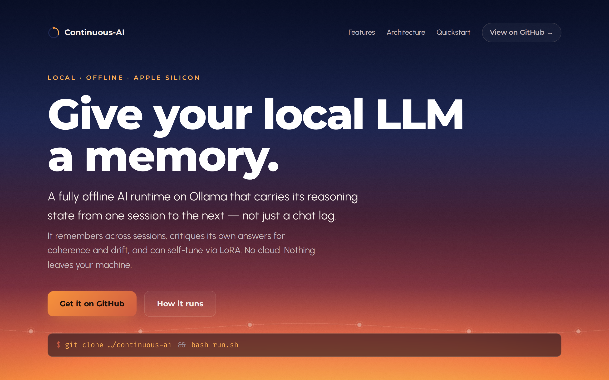

<p align="center">
  <h1 align="center">Continuous-AI</h1>
</p>

<p align="center">
  <strong>Give your local LLM a memory. A fully offline AI runtime on Ollama that remembers across sessions, critiques its own answers, and can self-tune — on Apple Silicon, no cloud.</strong>
</p>

<p align="center">
  <a href="https://github.com/StewAlexander-com/continuous-ai/actions/workflows/ci.yml"></a>
  <a href="https://stewalexander-com.github.io/continuous-ai/"></a>
  <a href="https://www.python.org/downloads/"></a>
  
  <a href="LICENSE"></a>
  
</p>

<p align="center">
  <a href="https://stewalexander-com.github.io/continuous-ai/">
    
  </a>
</p>

<p align="center">
  <a href="#quickstart">Quickstart</a>
  ·
  <a href="#what-it-does">What it does</a>
  ·
  <a href="#architecture">Architecture</a>
  ·
  <a href="#commands">Commands</a>
  ·
  <a href="#self-tuning-rdst">Self-tuning</a>
</p>

---

Most local LLM setups are amnesiacs: every chat starts from zero. **Continuous-AI** adds a persistent, versioned, machine-writable memory layer on top of [Ollama](https://ollama.com) so the model carries its *reasoning state* — not just a chat log — from one session to the next. A second model pass scores every answer for coherence and drift, and that signal can optionally drive local LoRA fine-tuning.

> **Status:** experimental research runtime. CLI-first. macOS / Apple Silicon (M1 or later).

## Quickstart

```bash
git clone https://github.com/StewAlexander-com/continuous-ai.git
cd continuous-ai
bash setup.sh      # one-time: builds a venv, installs deps, pulls the model
bash run.sh        # starts Ollama if needed, then drops you into chat
```

`run.sh` is the single entry point — it starts the Ollama server if it isn't already running, makes sure the model is pulled, and launches the chat loop. No manual `ollama serve`, no virtualenv activation, no shell gymnastics.

> **Prefer a button?** On macOS, double-click `Seedling.command` in Finder. (First launch: right-click → Open to clear the unidentified-developer prompt.)

### Requirements

- macOS on Apple Silicon (M1 or later)
- **Python 3.11–3.13** — 3.14 is not yet supported (`lancedb`/`pyarrow` have no 3.14 wheels). `setup.sh` enforces this and tells you how to fix it.
- [Ollama](https://ollama.com) installed (`brew install ollama`)

## What it does

- 🧠 **Persistent memory across sessions** — a Mutable Context Map (MCM) stores reasoning preferences, active frameworks, confidence traces, and per-thread cognitive deltas in [LanceDB](https://lancedb.com). Not a chat log.
- 🔌 **Automatic context restore** — at session start the latest state is injected into the system prompt; at session end the model emits a structured *delta* that's written back.
- 🔍 **Self-critique** — a second model pass scores every response for coherence, contradiction, and drift before it's logged.
- 🛰️ **Fully offline by default** — no cloud calls. An optional Perplexity critic backend exists for a stronger independent signal, but it's off unless you opt in.
- 🪄 **Gated self-tuning** — after enough sessions, the best exchanges (recency-weighted) can drive a local LoRA update via [`mlx-lm`](https://github.com/ml-explore/mlx-lm). **Never runs without explicit approval.**
- 💾 **Recoverable & auditable** — every state write is logged; all state is reconstructable from snapshots.

## Architecture

Continuous-AI is built from four subsystems:

| Subsystem | Role |
|---|---|
| **MCM** — Mutable Context Map | Persistent, versioned, AI-writable state across threads (`mcm.py`, `storage.py`). |
| **TCB** — Thread Continuity Bridge | Loads MCM state into the prompt at start; extracts and writes a delta at end (`session.py`). |
| **CRITIC** — Internal Observer | Scores each response for coherence / contradiction / drift, local or Perplexity backend (`critic.py`). |
| **RDST** — Regressive Dynamic Self-Tuning | Recency-weighted scoring + gated LoRA adapter updates (`tuner.py`). |

```
  start ─► MCM.restore_context() ─► inject into system prompt ─► Ollama chat
                                                                     │
                                          response ◄────────────────┘
                                             │
                                   CRITIC.evaluate() ─► coherence / drift scores
                                             │
   end ─► delta extraction ─► MCM.write_delta() ─► LanceDB + snapshot
                                             │
              (after N threads) ─► RDST.score_threads() ─► [approval] ─► LoRA tune
```

## Commands

```bash
bash run.sh             # chat with restored context (default)
bash run.sh fresh       # chat with no prior context
bash run.sh status      # print the current memory (MCM) state summary
bash run.sh eval        # run the evaluation report + failure-mode tests
bash run.sh snapshot    # write a manual state snapshot
```

You can always call the CLI directly: `./.venv/bin/python seedling.py <command>`.

## Configuration

All tunables live in [`config.yaml`](config.yaml): model name, critic backend, tuning threshold, recency decay, correction penalty, log level, and evaluation thresholds. Defaults are sensible for a first run (`llama3.2`, local critic).

To use the optional Perplexity critic backend for a stronger, independent evaluation signal:

```bash
# in config.yaml: critic_backend: "perplexity"
export PERPLEXITY_API_KEY=pplx-...
```

## Self-tuning (RDST)

Tuning is an explicit, gated step — it never runs on its own.

```bash
./.venv/bin/python seedling.py tune                    # show the scoring table only
./.venv/bin/python seedling.py tune --approve-tuning   # build data + run LoRA update
```

Before a real run you'll need MLX and an MLX-converted model (LoRA can't tune a raw GGUF):

```bash
./.venv/bin/python -m pip install mlx-lm
./.venv/bin/python -m mlx_lm.convert \
  --hf-path meta-llama/Llama-3.2-3B-Instruct --mlx-path ./models/llama32-mlx
```

Training data is assembled only from sessions that have a saved transcript, so run a few real chats first.

## Project layout

```
continuous-ai/
├── run.sh / Seedling.command   # one-button launchers
├── setup.sh                    # one-time environment bootstrap
├── seedling.py                 # CLI entry point
├── schemas.py                  # all dataclasses (state, deltas, critic, tuning)
├── mcm.py                      # Mutable Context Map: restore / write / pause
├── session.py                  # ThreadSession: start / chat / end + transcripts
├── critic.py                   # CriticInstance: local or Perplexity backend
├── tuner.py                    # RDST: scoring, training-data build, LoRA tuning
├── storage.py                  # LanceDB wrapper (tables, snapshots)
├── eval.py                     # metrics, drift, failure-mode tests
├── config.yaml                 # all tunable parameters
└── prompts/                    # context-restore, delta-extraction, critic prompts
```

Runtime state (`.seedling_db/`, `logs/`, `snapshots/`, `training_data/`, `adapters/`) is created on first run and is git-ignored.

## Design constraints

- **Fully local** by default — no cloud calls.
- **No stealth writes** — every state write is logged.
- **Graceful shutdown** — `graceful_pause()` snapshots state instead of dying on a signal.
- **Recoverable** — all state is reconstructable from snapshots.
- **Emergent output is preserved**, not suppressed — unexpected behavior is flagged (`emergent=true`), never silently dropped.

## Notes & limitations

- Small models (e.g. `llama3.2:3b`) can be factually shaky and occasionally fumble the delta-extraction JSON; the runtime has graceful fallbacks for both.
- A **local** critic is the same base model grading itself — a deliberately weak signal. For sharper evaluation, switch to the Perplexity backend.
- The post-tuning before/after eval loop in `tuner.py` is currently a stub.

## Contributing

Issues and pull requests are welcome. CI runs on Python 3.11–3.13 and exercises module compilation, schema serialization, and the failure-mode suite — please keep it green. See [CONTRIBUTING.md](CONTRIBUTING.md).

## License

[MIT](LICENSE) © Stewart Alexander
