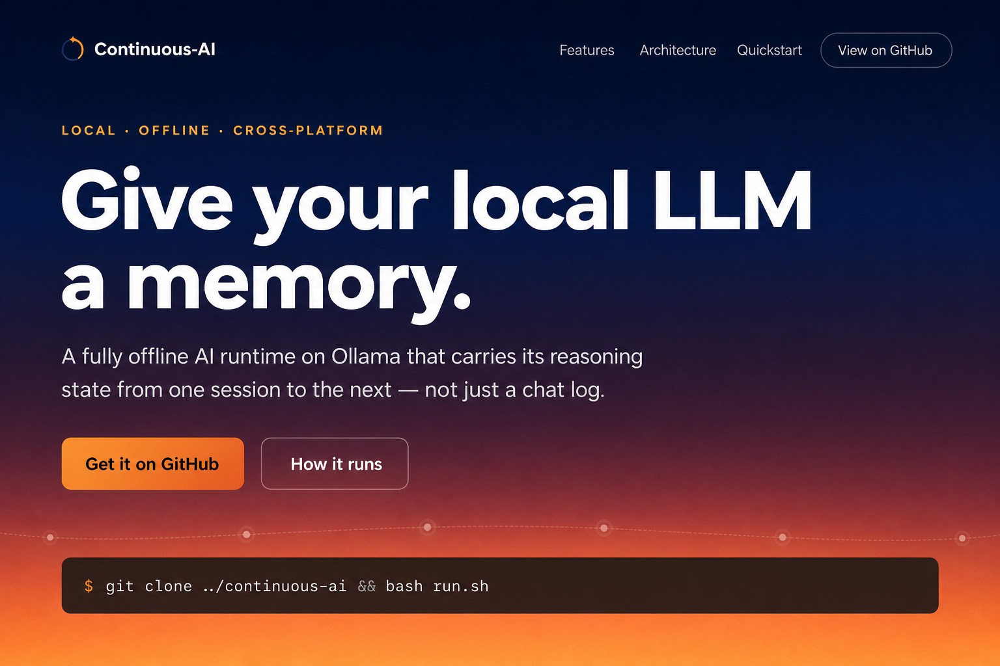
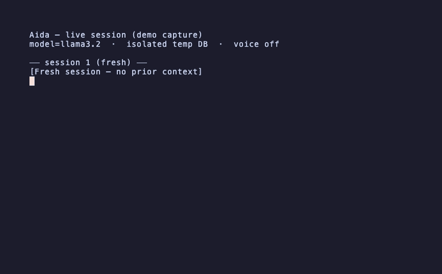
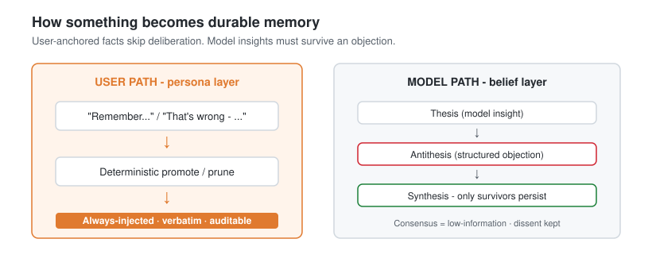
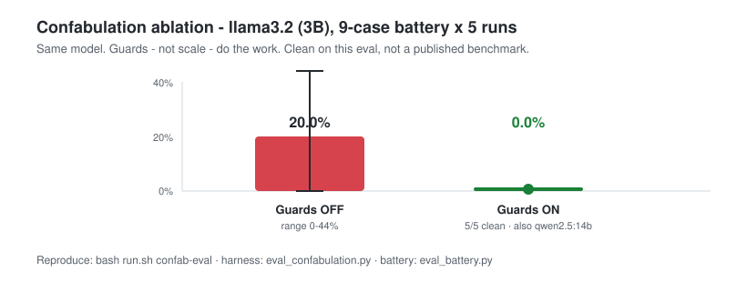
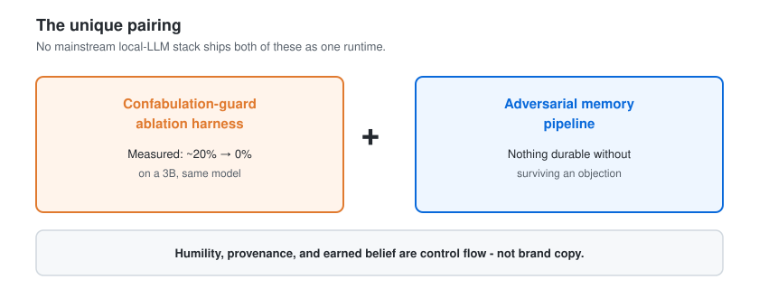
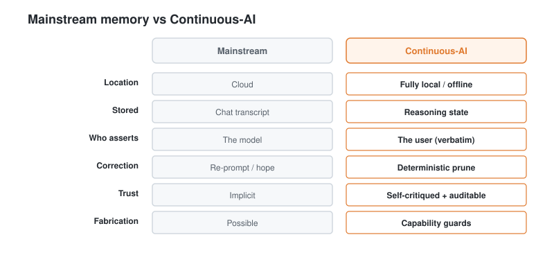
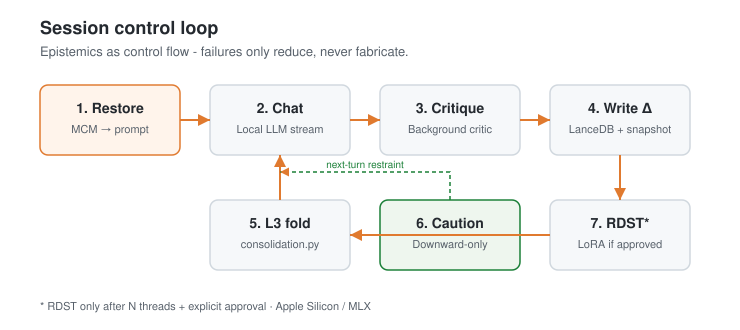
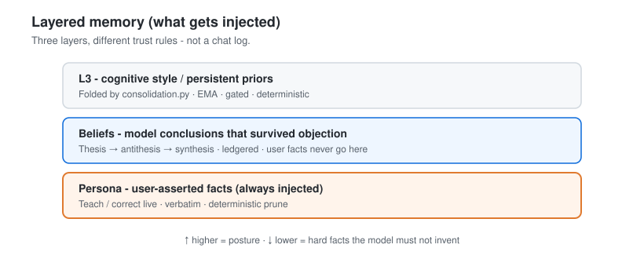
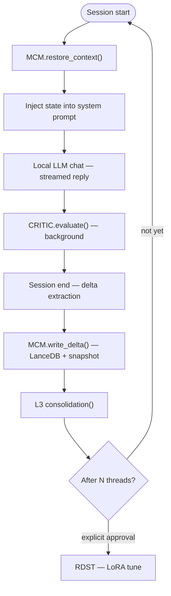

<p align="center">
  <a href="https://www.honest-aida.ai/" title="Open the Continuous-AI site">
    
  </a>
</p>

<h1 align="center">Aida — a truly honest local AI</h1>

<p align="center">
  <strong>A fully offline, cross-platform memory + integrity runtime for local LLMs.</strong><br>
  Aida <strong>won't make things up</strong> and carries a <strong>reasoning memory you own, audit, and correct in plain language</strong> — never shipped to a cloud. On a 3B model, integrity guards cut measured confabulation from <strong>~20% to 0%</strong> on a 9-case battery (5 runs) — clean on this eval, not a published benchmark. Runs on <strong>Ollama</strong> (default) or any <strong>local</strong> OpenAI-compatible server (LM Studio, llama.cpp, vLLM).
</p>

<p align="center">
  <a href="https://github.com/StewAlexander-com/continuous-ai/actions/workflows/ci.yml"></a>
  <a href="https://github.com/StewAlexander-com/continuous-ai/releases"></a>
  <a href="https://www.python.org/downloads/"></a>
  
  <a href="LICENSE"></a>
  
  <a href="https://www.honest-aida.ai/"></a>
</p>

<p align="center">
  <a href="#quickstart">Quickstart</a> ·
  <a href="#recent">Recent</a> ·
  <a href="#what-aida-does">Features</a> ·
  <a href="#does-it-actually-work">Proof</a> ·
  <a href="#why-its-different">Different</a> ·
  <a href="#architecture">Architecture</a> ·
  <a href="https://www.honest-aida.ai/">Website</a>
</p>

---

Most local-LLM setups are **amnesiacs that also confidently make things up**. Aida is different on both counts — and no mainstream cloud assistant ships those two properties together.

Under the hood, the **Continuous-AI** runtime adds a durable *reasoning state* (not a chat log) on top of a **local** inference backend ([Ollama](https://ollama.com) by default; optional LM Studio / llama.cpp / vLLM), scores every answer for coherence and drift, and can optionally drive local LoRA fine-tuning. *(Aida is the assistant; Continuous-AI is the runtime that powers her.)*

> **Who it's for:** anyone who needs durable, trustworthy AI context where the cloud can't go — air-gapped/secure ops, robotics & edge autonomy, healthcare at the edge, regulated/compliance work, and privacy-first personalization.
>
> **Status:** experimental research runtime. CLI-first. Cross-platform; macOS / Apple Silicon is the primary, best-tested target.

<p align="center">
  <a href="https://www.honest-aida.ai/" title="Open the Continuous-AI site">
    
  </a>
  <br>
  <sub>Teach a fact → reply → persona saved live → memory restored.<br>
  <i>Recorded from a live local session (isolated temp DB) via VHS — re-run with <code>vhs docs/assets/demo.tape</code>.</i></sub>
</p>

## Recent

**Latest release:** [**v2.14.21**](https://github.com/StewAlexander-com/continuous-ai/releases/tag/v2.14.21) — stop attach-file prose from false-triggering memory correction ([notes](RELEASE_NOTES_2.14.21.md)).

| Release | What landed | Commit |
|---|---|---|
| **[v2.14.21](https://github.com/StewAlexander-com/continuous-ai/releases/tag/v2.14.21)** | Correction scans only the ask region of `:read` turns (file body phrases like “the correct X is” no longer open the prune menu); `The user attached …` ask-suffixes treated as attach pollution | [`1ab4f28`](https://github.com/StewAlexander-com/continuous-ai/commit/1ab4f28) |
| **[v2.14.20](https://github.com/StewAlexander-com/continuous-ai/releases/tag/v2.14.20)** | Versioned guard regression patches (`guards.py`); `OLLAMA_HOST` local-only on the default backend; caution ignores critic parse noise; crash-safe context upserts; opt-in MCM signal handlers | [`c501e0d`](https://github.com/StewAlexander-com/continuous-ai/commit/c501e0d) · ship [`43e435f`](https://github.com/StewAlexander-com/continuous-ai/commit/43e435f) |
| **[v2.14.19](https://github.com/StewAlexander-com/continuous-ai/releases/tag/v2.14.19)** | Chat + critic coresidency on 32GB Macs (`num_ctx` 8k / critic 2k, `OLLAMA_MAX_LOADED_MODELS=2`); spinner clears on first thinking token | [`b2fc2fd`](https://github.com/StewAlexander-com/continuous-ai/commit/b2fc2fd) |

**Site (honest-aida.ai):** live demo GIF + calibrated hero ([`2233ffa`](https://github.com/StewAlexander-com/continuous-ai/commit/2233ffa)); *epistemics as control flow* differentiator ([`7654401`](https://github.com/StewAlexander-com/continuous-ai/commit/7654401)); SNR cleanup ([`d3a8d87`](https://github.com/StewAlexander-com/continuous-ai/commit/d3a8d87)). Full history: [releases](https://github.com/StewAlexander-com/continuous-ai/releases).

## Quickstart

**Requirements:** [Python 3.11–3.13](https://www.python.org/downloads/) and a **local** inference server — [Ollama](https://ollama.com) is the default. Works on macOS, Linux, and Windows (on Windows, run shell scripts under WSL or Git Bash).

```bash
git clone https://github.com/StewAlexander-com/continuous-ai.git
cd continuous-ai
bash setup.sh       # one-time: venv, deps, pull the model
bash setup_voice.sh # optional: local neural voice (~330 MB)
bash run.sh         # starts Ollama if needed, then chat
```

Already on LM Studio or llama.cpp? Set `inference_backend: openai_compat` in [`config.yaml`](config.yaml) (cloud URLs and remote `OLLAMA_HOST` values are blocked).

<details>
<summary><strong>Ollama install · Finder launch (macOS)</strong></summary>

**Ollama:** `brew install ollama` (macOS) · `curl -fsSL https://ollama.com/install.sh | sh` (Linux) · [ollama.com/download](https://ollama.com/download) (Windows).

**Finder:** double-click **`Seedling.command`**. First launch may need right-click → **Open** once for Gatekeeper.

</details>

## What Aida does

| | Capability |
|---|---|
|  | **Persistent memory.** MCM stores reasoning preferences, frameworks, and confidence in [LanceDB](https://lancedb.com) — *reasoning state*, not a chat log. |
|  | **Teach it live.** *"Remember…"* / *"your name is…"* promotes to an always-injected persona layer and saves instantly. |
|  | **Correct it by talking.** *"That's wrong — the location is Mebane, NC"* prunes by *your* words. The model never guess-deletes. |
|  | **Self-critique + graded caution.** Background coherence/drift scoring; downward-only restraint on the next reply when it slips. |
|  | **Earned beliefs.** Model insights survive an objection before persisting; on hard turns she can ask *you* to co-author. [How →](#why-its-different) |
|  | **Read your files.** `:read` attaches file / PDF / DOCX / glob; `:more` pages. Runtime reads; the model never browses alone. |
|  | **Structural preferences (`:dispositions`).** Policy rankings (honesty, L3, caution, speak-bias) — not pretended emotions. |
|  | **Offline voice.** Kokoro `af_kore` — never voices code, paths, URLs, or file contents. |
|  | **Pick your local brain.** Ollama or `openai_compat`. `:model` / `:setup` / `:help` in chat. |
|  | **Gated self-tuning.** Optional local LoRA via Apple [MLX](https://github.com/ml-explore/mlx-lm) — never without explicit approval (Apple Silicon only). |

<p align="center">
  
</p>

## Does it actually work?

Confabulation/persistence harness: [`eval_confabulation.py`](eval_confabulation.py) · battery [`eval_battery.py`](eval_battery.py) · scorer tests [`test_eval_confab.py`](test_eval_confab.py). Same `GUARD_TEXT` the runtime injects — no test-prompt drift.

<p align="center">
  
</p>

| Configuration | Mean confabulation | Range |
|---|---|---|
| `llama3.2` (3B), **guards off** | **20.0%** | 0–44% |
| `llama3.2` (3B), **guards on** | **0.0%** | 0–0% (5/5 clean) |
| `qwen2.5:14b`, **guards on** | **0.0%** | 0–0% (5/5 clean) |

Reproduce: `bash run.sh confab-eval`. End-to-end stack: `bash run.sh smoke`.

> **Honest scope:** 9-case smoke test on one machine, not a published benchmark. 0% means "clean on this battery," not "incapable." Guards-off variance (0–44%) shows the battery can detect failures.

## Why it's different

<p align="center">
  
</p>

| Mechanism | One line |
|---|---|
| **Beliefs through friction** | Thesis → antithesis → synthesis before a model insight persists; consensus is low-information. |
| **Contested document osmosis** | Attached PDFs enter pre-loaded with dissent + hash provenance + promotion budget. |
| **Doubt-scope** | Deliberation may challenge the model — never a user-anchored fact. |
| **Downward-only caution** | Restraint can only reduce assertion; every decision is an auditable report. |
| **Versioned prompt patches** | Case-specific guard fixes live in `guards.py` patches (ids, since-versions, tests) — core stays auditable. |

**Engineering that holds it up:** fail-safe by default (failures never fabricate); deterministic code guards the model (never asked which fact to delete); eval measures the shipped artifact. ([Site section →](https://www.honest-aida.ai/#different))

## Why it matters — and who it's for

> Aida is a personal assistant on the surface. Underneath, it's a **reference implementation**: durable, auditable, user-correctable *reasoning state* for a local model, with integrity guards that make confabulation structurally hard.

<p align="center">
  
</p>

<details>
<summary><strong>Where it's useful & transferable principles</strong></summary>

| Domain | Why this pattern fits |
|---|---|
| **Secure / air-gapped** | Offline by default; auditable writes; no fabricated environment "facts" |
| **Robotics / edge** | Persistent reasoning-state across runs; self-critique catches drift |
| **Healthcare at the edge** | Nothing leaves the device; user-anchored facts + critic as safety |
| **Legal / compliance** | Attributable context; model barred from inventing precedent |
| **Personalization without surveillance** | Durable, local, inspectable — never phones home |

1. **The user owns truth** — durable facts are human-asserted, verbatim.
2. **The model never silently rewrites memory** — pruning is deterministic.
3. **Every write is auditable and recoverable** — logged, versioned, snapshot-restorable.
4. **Self-critique before trust** — outputs scored before they shape future state.
5. **Offline is the default** — privacy and capability boundaries are structural.

</details>

## Answering the standard AI critiques

The durable objections to AI are about **unaccountable power**: inventing facts, echo chambers, opacity, silent rewrites, unnoticed drift, unverifiability. Each has a *structural* answer here — a mechanism you can read and run — not a promise.

| Contention | Structural answer | Code |
|---|---|---|
| **"It makes things up."** | Offline capability boundary; `:read` is runtime-attached only. Ablation: ~20% → **0%** on a 3B. | [`session.py`](session.py), [`filereader.py`](filereader.py), [`eval_confabulation.py`](eval_confabulation.py) |
| **"It's sycophantic."** | No model insight persists without surviving an objection; dissent is kept. | [`deliberation.py`](deliberation.py) |
| **"It's a black box."** | Logged writes, JSONL deliberation ledger, snapshot restore; L3 fold is deterministic. | [`storage.py`](storage.py), [`consolidation.py`](consolidation.py) |
| **"It will rewrite what I told it."** | User facts are verbatim; correction is a deterministic prune matched to *your* words. | [`mcm.py`](mcm.py), [`session.py`](session.py) |
| **"It drifts quietly."** | Background critic + downward-only caution on the next turn. | [`critic.py`](critic.py), [`caution.py`](caution.py) |
| **"You can't verify it."** | `bash run.sh smoke` (17 live checks) · `bash run.sh confab-eval` | [`smoke_test.py`](smoke_test.py) |

**Out of scope:** macro AGI risk, frontier-lab governance, military AI. Belief *formation* uses live model calls (ledgered, not a pure function); the optional Perplexity critic is an explicit cloud opt-in. The testable claim: those failure modes are design choices, not laws of nature.

## Architecture

| Subsystem | Role |
|---|---|
| **MCM** — Mutable Context Map | Persistent, versioned state across threads (`mcm.py`, `storage.py`). |
| **TCB** — Thread Continuity Bridge | Inject at start; delta at end (`session.py`). |
| **L3** — Self-shaping cognition | Fold gated deltas into every prompt's posture (`consolidation.py`). |
| **CRITIC** — Internal Observer | Coherence / contradiction / drift (`critic.py`). |
| **RDST** — Regressive Dynamic Self-Tuning | Gated LoRA updates (`tuner.py`). |

<p align="center">
  
</p>

<p align="center">
  
</p>

<details>
<summary><strong>Flowchart source (Mermaid)</strong></summary>



</details>

## Commands

```bash
bash run.sh              # chat with restored context
bash run.sh fresh        # no prior context
bash run.sh status       # MCM + persona facts
bash run.sh forget       # list/remove persona facts
bash run.sh confab-eval  # confabulation / persistence eval
bash run.sh smoke        # end-to-end stack (isolated temp DB)
bash run.sh bench 5      # TTFT + tokens/sec
bash run.sh health       # parse + tests + honesty + smoke
bash run.sh --model qwen2.5:7b   # one-off model (auto-pulls)
```

Or: `./.venv/bin/python seedling.py <command>` (also how you reach `tune`).

### In-chat commands

Single-line only. Type `:help` for the full list.

| Command | What it does |
|---|---|
| `:help` / `:setup` / `:dispositions` | Reference · backend/readers · structural preferences |
| `:model` / `:models` | List and switch (Ollama auto-pulls) |
| `:read <path>` | Attach file / PDF / DOCX / glob / directory (`~` works); typo → numbered pick list |
| `:more` | Next chunk of a large attachment |
| `:voice on\|off` · `chatty\|terse\|normal` | Spoken replies |
| `exit` / `quit` | End session |

Plain language works for voice (`"go silent"`) and file read (`read ~/foo.py`, `read ~/papers/*.pdf what are the themes?`).

<details>
<summary><strong>PDF · DOCX readers</strong></summary>

**PDF:** born-digital after `bash setup.sh` (`pymupdf`). Scanned pages need Tesseract + `./.venv/bin/pip install pytesseract pillow`.

**DOCX:** after `setup.sh` (`python-docx`). Legacy `.doc` → save as `.docx` or PDF first. `:setup` shows reader status.

</details>

## Configuration

All tunables: [`config.yaml`](config.yaml). Defaults suit a capable first run (`qwen2.5:14b` on Ollama, local critic); set `model_name: llama3.2` for a lighter 3B.

<details>
<summary><strong>Key behavior switches</strong></summary>

| Key | Default | What it does |
|---|---|---|
| `inference_backend` | `ollama` | `ollama` or `openai_compat`. Non-loopback URLs / remote `OLLAMA_HOST` blocked. |
| `model_name` | `qwen2.5:14b` | Chat model id |
| `deliberation_enabled` / `live_deliberation_enabled` | `true` | Belief deliberation (end + per-turn background) |
| `caution_controller_enabled` | `true` | Downward-only caution from lagged critic |
| `collaborative_wall_enabled` | `true` | Ask user on genuinely hard turns (pre-gated) |
| `history_window_turns` | `24` | Recent exchanges re-fed per turn |
| `chat_options` | `{}` | Ollama options (`num_ctx`, `num_predict`); v2.14.19 ships `num_ctx: 8192` for dual-load |

Optional Perplexity critic: `critic_backend: "perplexity"` + `PERPLEXITY_API_KEY`.

</details>

## Platform support

| Capability | macOS (Apple Silicon) | Linux | Windows |
|---|---|---|---|
| Core (chat, memory, guards, critic, deliberation, `:read`) |  primary |  |  (WSL/Git Bash for scripts) |
| Neural voice (Kokoro) |  |  |  |
| Gated self-tuning (LoRA / MLX) |  |  Apple-only |  Apple-only |

## Deep dives

<details>
<summary><strong>Layered memory (persona · beliefs · L3)</strong></summary>

See the Architecture diagram above. User facts live in an always-injected **persona** layer (promoted live). Model conclusions must earn a **belief** layer via deliberation. Above both: `cognitive_style` + `persistent_priors` folded by `consolidation.py` (EMA, gated, deterministic). L3 A/B: [results](docs/design/l3-eval-results.md) — style shift measured, blind quality judgment **not yet run**. See [memory-layering.md](docs/design/memory-layering.md).

</details>

<details>
<summary><strong>Deliberated beliefs</strong></summary>

Thesis → antithesis → synthesis; disagreement preserved; consensus = low-information; depth capped at `MAX_ROUNDS = 3`; ledger in `deliberation_ledger/`. **User facts bypass this entirely.** Outcome A/B (does it improve cognition?) is **unproven, not disproven**.

</details>

<details>
<summary><strong>Graded caution</strong></summary>

Lagged critic → fuzzy bands (`OFF → GUARDED → RESTRAINED → DECLINE_FIRST`), downward-only, no reply-path model call. See [caution-disposition.md](docs/design/caution-disposition.md).

</details>

<details>
<summary><strong>Reading files (:read / :more)</strong></summary>

Runtime reads paths; model never browses. Paths with spaces, globs + trailing questions, directory browse (mtime-sorted), PDF/DOCX paging via `:more`. URLs/GitHub refused. 0% confabulation on the retrieval battery.

</details>

<details>
<summary><strong>Presence, voice & responsiveness</strong></summary>

Operational tone from real signals (not invented mood). Kokoro offline with a deterministic speak floor. Critic/deliberation yield the GPU to your turn; dual-model residency on typical 32GB Macs (v2.14.19). See [voice-hybrid-deliberation.md](docs/design/voice-hybrid-deliberation.md).

</details>

<details>
<summary><strong>Self-tuning (RDST) — Apple Silicon only</strong></summary>

```bash
./.venv/bin/python seedling.py tune                    # scoring table
./.venv/bin/python seedling.py tune --approve-tuning   # LoRA update
```

Needs `mlx-lm` + an MLX-converted base model. Post-tuning before/after eval in `tuner.py` is currently a **stub**.

</details>

<details>
<summary><strong>Notes &amp; limitations</strong></summary>

- Small models can fumble facts / delta JSON — runtime has fallbacks.
- A **local** critic is the same base model grading itself (weak by design); Perplexity is opt-in.
- Inference is pluggable (`llm.py`); cloud endpoints blocked.
- Plain-language file read is conservative; glob + immediate question attaches chunk 1 — page with `:more` for corpora.

</details>

## Project layout

<details>
<summary><strong>Expand file tree</strong></summary>

```
continuous-ai/
├── run.sh / Seedling.command
├── setup.sh / setup_voice.sh
├── seedling.py                 # CLI
├── llm.py                      # Ollama + openai_compat (local-only)
├── guards.py                   # core GUARD_TEXT + versioned regression patches
├── schemas.py / mcm.py / session.py / storage.py
├── deliberation.py / live_deliberation.py / wall.py / wallgate.py
├── caution.py / critic.py / consolidation.py
├── voicelayer.py / filereader.py / pdfreader.py / docxreader.py
├── eval*.py / config.yaml / prompts/
├── scripts/record_demo.py      # live VHS demo capture
└── scripts/gen_readme_diagrams.py  # regenerate docs/assets/readme/*.svg
```

Runtime state (`.seedling_db/`, `logs/`, `snapshots/`, …) is git-ignored.

</details>

## Star history

<a href="https://star-history.com/#StewAlexander-com/continuous-ai&Date">
  
</a>

## Contributing

Issues and PRs welcome — experimental research runtime. CI: Python 3.11–3.13, module compile, schemas, failure-mode suite. See [CONTRIBUTING.md](CONTRIBUTING.md).

> Layered memory is an independent design informed by ideas from [Mem0](https://github.com/mem0ai/mem0) and [TencentDB-Agent-Memory](https://github.com/TencentCloud/TencentDB-Agent-Memory) — no code reused.

## License

[MIT](LICENSE) © Stewart Alexander
